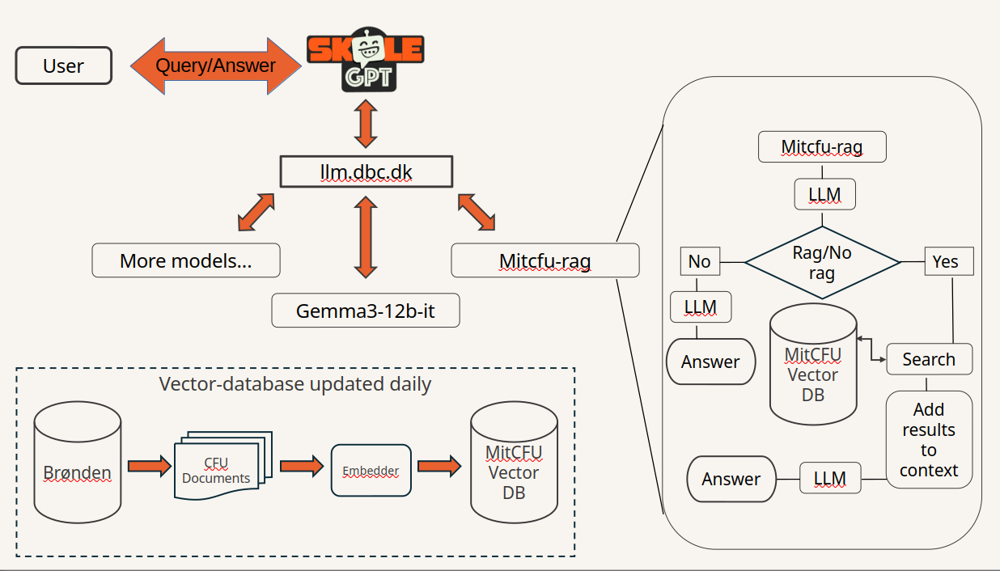

# SkoleGPT grænsefladen

Grænsefladen bygger på opensource projektet NextChat.
Vi har lavet en del tilretninger, bugfixes, etc. som ligger i “skolegpt”-branchen i dette repo.
De fleste ændringer er lagt bag feature-flag, så de kan slås fra/til og tilpasses via NEXT_PUBLIC_…-“environment variable”.

Anonymiseret statistik opsamles i DBCs Matomo, og ugentlig statistik siden uge 42 2025 kan ses på https://skolegpt-stat.dbc.dk/.

Chats, brugerdefinerede assistenter, etc. bliver er udelukkende gemt i brugerens webbrowser, og bliver ikke gemt på serveren. 

De indbyggede assistenter er defineret i  <app/masks/skolegpt.ts>

## LLM-gateway

Adgang til sprogmodellen foregår via llm.dbc.dk, som er indgangen til de forskellige AI-modeller som DBC kører.

 Det bruger samme industry-standard-API som OpenAI og mange andre LLM-leverandører. Den tekniske dokumentation kan ses på  

Når man kalder llm.dbc.dk, skal man give et adgangstoken med.Hvert token kan begrænses til kunne bruge specifikke modeller.
Hvis I har brug for flere tokens, må I sige til i forhold til dette. Det vil nok være en fordel.

I kan altid se den komplette liste over modeller jeres tokens giver adgang til med
```
curl -sS http://glyph-gate-1-0.ai-prod.svc.cloud.dbc.dk/v1/models \
  -H 'Content-Type: application/json' \
  -H "Authorization: Bearer $LLM_DBC_TOKEN"
```

- "skolegpt" – gemma3
- "skolegpt-v3" – også gemma3
- "mitcfu-rag" – RAG-løsning
- "science-rag" – RAG-løsning

Som sagt kan vi opdatere dette i løbende dialog.

Herunder er et par simple eksempler på hvordan man ved hjælp af kode benytter sprogmodellerne:
Python eksempel på brug af llm.dbc.dk:
```
#!/usr/bin/env python3  
import requests  
import json

url = "https://llm.dbc.dk/v1/chat/completions"  
headers = {  
    "Content-Type": "application/json",  
    "Authorization": "Bearer " + SOME_TOKEN,  
    "Accept": "text/event-stream"  
}  
payload = {  
    "messages": [  
        {  
            "role": "system",  
            "content": (  
                "Du er SkoleGPT, en dansk sprogmodel udviklet af Center for Undervisningsmidler (CFU). "  
                "Du bygger på sprogmodellen Mixtral-8-7b. Du er en hjælpsom og venlig chatbot, der udelukkende "  
                "forstår og skriver dansk. Du vil altid svare på dansk og ingen andre sprog. Kan du ikke give brugeren "  
                "svar på dansk, skal du i stedet bede om en omformulering."  
            )  
        },  
        { "role": "user", "content": "Hvad er meningen med livet?" }  
    ],  
    "stream": True,  
    "model": "skolegpt",  
    "temperature": 0.7,  
    "top_p": 0.95  
}

# Send the POST request with streaming enabled  
with requests.post(url, headers=headers, json=payload, stream=True) as resp:  
    resp.raise_for_status()  
    for line in resp.iter_lines(decode_unicode=True):  
        if not line: continue  
        if line.startswith("data:"):  
            data = line[len("data:"):].strip()  
            if data == "[DONE]":  
                break  
            chunk = json.loads(data)  
            if len(chunk["choices"]) > 0 and "content" in chunk["choices"][0]["delta"]:  
                print(chunk["choices"][0]["delta"]["content"], end="", flush=True)
```
Alternativt med OpenAI
```
import os
from openai import OpenAI
base_url = "https://llm.dbc.dk/v1"
client = OpenAI(base_url=base_url, api_key=os.environ.get("LLM_DBC_TOKEN")
models = client.models.list()
client.chat.completions.create(
        model=models.data[0].id,
        messages=[{"role": "user", "content": "How many r's are there in the word strawberry?"}],
)
```

JavaScript eksempel på brug af sprogmodel:
```
async function llm(message, apiKey) {  
    const systemPrompt = "Du er SkoleGPT, en dansk sprogmodel udviklet af Center for Undervisningsmidler (CFU). Du bygger på sprogmodellen Mixtral-8-7b. Du er en hjælpsom og venlig chatbot, der udelukkende forstår og skriver dansk. Du vil altid svare på dansk og ingen andre sprog. Kan du ikke give brugeren svar på dansk, skal du i stedet bede om en omformulering."    // Send POST request to LLM  
    const res = await fetch("[https://llm.dbc.dk/v1/chat/completions](https://llm.dbc.dk/v1/chat/completions)", {  
        method: "POST",  
        headers: { "Content-Type": "application/json",  
            "Authorization": "Bearer " + apiKey,  
            "Accept": "text/event-stream"  
        },  
        body: JSON.stringify({  
            messages: [  
                { role: "system", content: systemPrompt },  
                { role: "user", content: message }  
            ],  
            stream: true,  
            model: "skolegpt",  
            temperature: 0.7,  
            presence_penalty: 0,  
            frequency_penalty: 0,  
            top_p: 0.95  
        })  
    });    // Handle streamed response  
    let response = ''  
    for await (const chunk of res.body) {  
        const text = new TextDecoder().decode(chunk);  
        const lines = text.split('\n').filter(line => line.trim() !== '');  
        for (const line of lines) {  
            if (line.startsWith('data: ')) {  
                if (line === 'data: [DONE]') return response;  
                const data = JSON.parse(line.substring(6));  
                response += data.choices[0].delta.content || ""  
                console.log(response)  
            }  
        }  
    }  
}

llm("Hello", SOME_TOKEN)
```

## MitCFU-RAG

MitCFU-RAG er en af de modeller der udstilles gennem llm.dbc.dk. I modsætning til de andre modeller er det her ikke en sprogmodel, men et ekstra lag der behandler både input inden det sendes til den egentlige sprogmodel, og til en vis grad også det output der sendes fra sprogmodellen. Den bruger sprogmoddeln google/gemma-3-12b-it til tekst-generering, og intfloat/multilingual-e5-large-instruct til embeddings. Begge modeller kan skiftes efter aftale.


Baseret på den forespørgsel der sendes, søges der efter relevant indhold i MitCFU. Hvis der er beskrivelser eller pædagogiske noter kan sprogmodellen bruge disse til at begrunde indholdets relevans, ellers bedømmes det ud fra titlen.

Der søges efter indhold gennem en vektor-database. Databasen baseres på MitCFU kataloget, som er katalogiseret i databrønden og opdateres dagligt. Posterne læses ind, lange beskrivelser inddeles i mindre bidder, og de laves om til et format der passer til vector-databasen. Hvis ønsket kan den model der embedder indholdet som vektorer udskiftes i takt med at nye og bedre modeller kommer på markedet.

Søgning i en vektordatabase baseres på den semantiske lighed mellem det der søges på og det indhold der er i databasen. For at forbedre søgningen bruger vi sprogmodellen til at lave 2-3 søgninger ud fra samtalen, så de er i et format der er tættere på det indhold der er i databasen. Derefter rerankeres resultaterne og de bedste udvælges.

## Science RAG

Baseres på samme teknologi som MitCFU-RAG og Custom RAG, men med en anden database.

Science RAG dokumenterne er delt med DBC Digital gennem et delt drev, og disse dokumenter indlæses på samme måde som i MitCFU-RAG og gemmes i en vektor-database.

## Custom RAG

Baseres på samme teknologi som MitCFU-RAG og Science RAG.